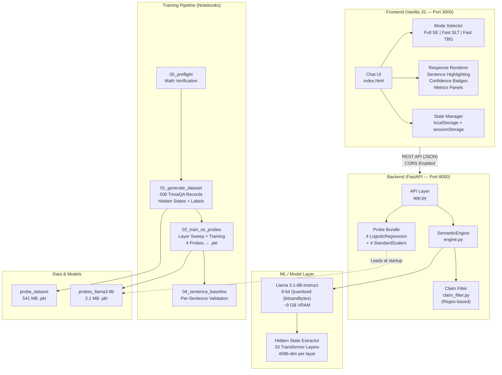
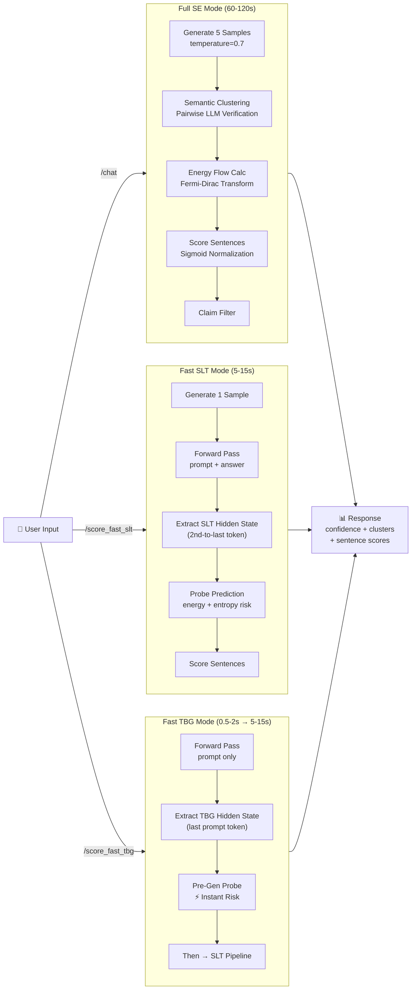
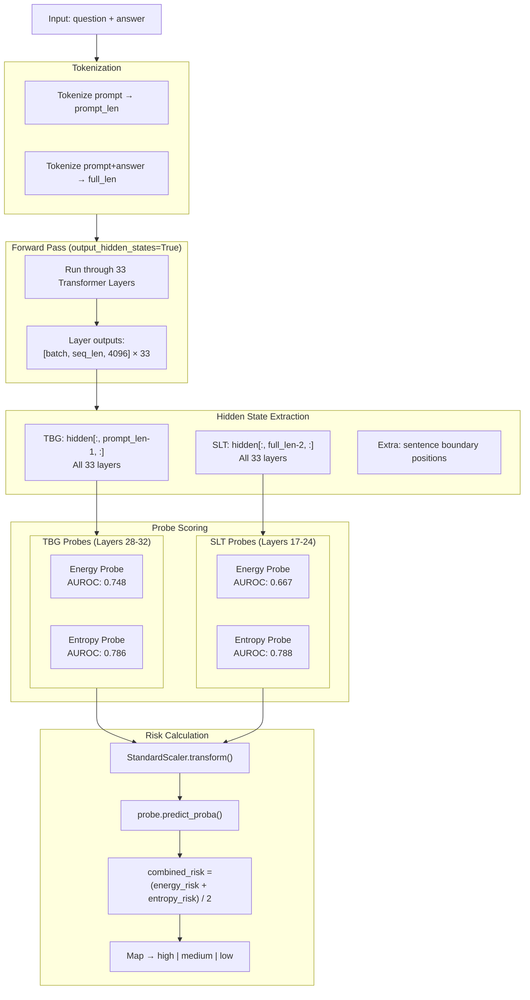
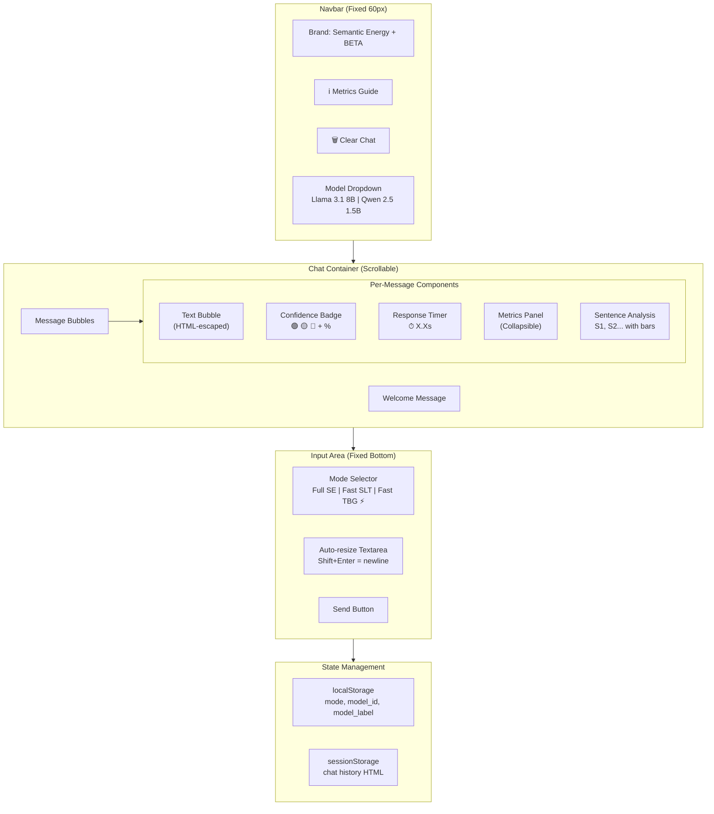
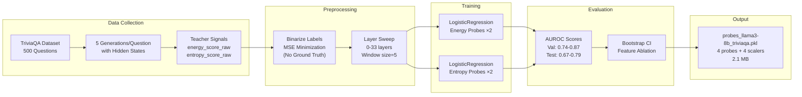

# SemanticEnergy — System Architecture Diagrams

## 1. High-Level System Architecture

## 2. Request Flow — Three Scoring Modes

## 3. Data Flow — Hidden State Extraction & Probe Scoring

## 4. Deployment Architecture

```mermaid
graph TB
    subgraph Local["Local Development"]
        SetupBat["setup.bat / setup.sh<br/>Python 3.12 + CUDA 12.4"]
        StartPS["start.ps1<br/>Launches both servers"]
        FE_Local["Frontend :3000<br/>Python http.server"]
        BE_Local["Backend :8000<br/>Uvicorn + FastAPI"]
        GPU_Local["NVIDIA GPU<br/>≥12 GB VRAM"]
        SetupBat --> StartPS
        StartPS --> FE_Local
        StartPS --> BE_Local
        BE_Local --> GPU_Local
    end

    subgraph HFSpaces["HuggingFace Spaces (Docker)"]
        Dockerfile["Dockerfile<br/>python:3.10-slim"]
        DeployStart["deploy_start.py<br/>Combined Server :7860"]
        StaticFiles["Static Files<br/>index.html, script.js, styles.css"]
        Dockerfile --> DeployStart
        DeployStart --> StaticFiles
    end

    subgraph FreeTier["Free Tier Architecture"]
        Vercel["Vercel<br/>Frontend (FREE)"]
        Colab["Google Colab<br/>Backend (FREE T4 GPU)"]
        Ngrok["ngrok<br/>Static Domain Tunnel"]
        HF_Hub["HuggingFace Hub<br/>Probe Storage"]
        Vercel -->|HTTPS| Ngrok
        Ngrok --> Colab
        Colab --> HF_Hub
    end
```

## 5. Frontend Component Architecture

## 6. ML Training Pipeline

