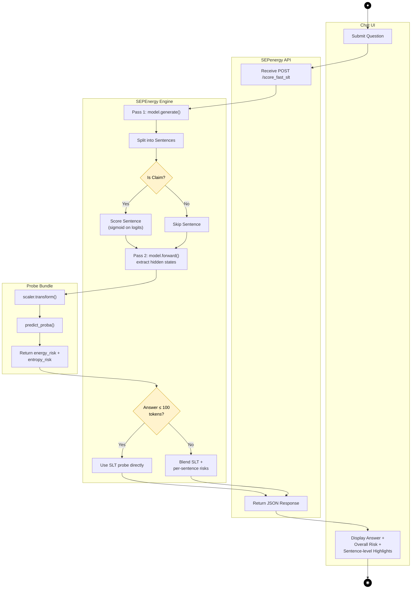

# SemanticEnergy — Activity Diagram (OOADM)

## SLT Scoring Activity Diagram

## Draw.io Instructions (Recommended for Thesis)

Since Mermaid cannot render proper UML activity diagram swim lanes, use draw.io:

1. Open **app.diagrams.net** → New Diagram
2. Choose template: **UML → Activity Diagram** (has all the right shapes)
3. Create **5 vertical swim lane partitions**:

| Swim Lane | Actions |
|-----------|---------|
| **Chat UI** | Submit Question, Display Results |
| **SEPenergy API** | Receive POST, Return JSON |
| **SEPEnergy Engine** | generate(), split_sentences(), score_sentences(), forward(), extract_hidden_states(), aggregate risk |
| **LLM** | Return answer + logits (Pass 1), Return hidden_states (Pass 2) |
| **Probe Bundle** | transform(), predict_proba(), return risks |

4. **Decision nodes** (diamonds):
   - "Is Claim?" → Yes: Score Sentence / No: Skip
   - "Answer ≤ 100 tokens?" → Yes: SLT direct / No: Blend risks

5. **Start**: Filled black circle (●) at top of Chat UI lane
6. **End**: Bull's-eye circle (◉) at bottom of Chat UI lane
7. **Control flow**: Solid arrows between actions
8. **Guard conditions**: Labels on decision branches [Yes] / [No]
