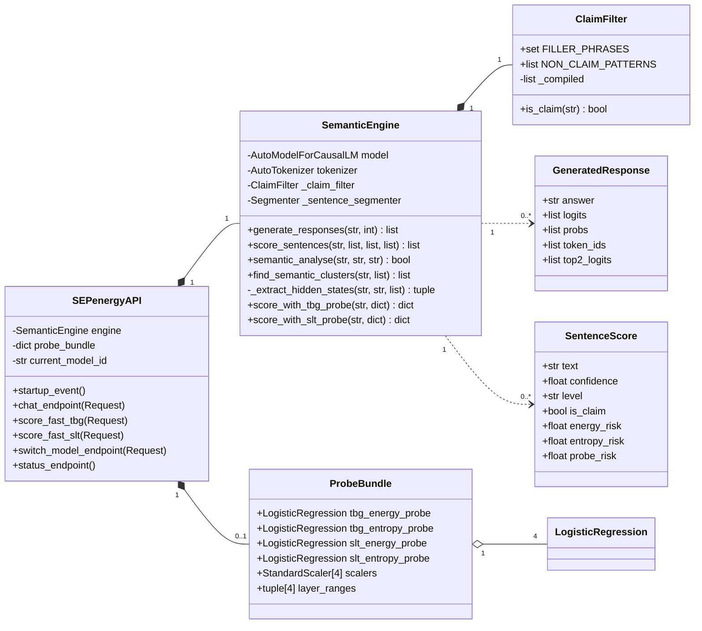

# SemanticEnergy — Class Diagram (OOADM)

## Compact Class Diagram (Thesis-friendly)

## Rendering Instructions

**Option A — Mermaid Live (fastest)**
1. Go to **mermaid.live**
2. Paste the code above
3. Export as SVG/PNG → insert into thesis

**Option B — draw.io manual build**
1. Open **app.diagrams.net**
2. Search "UML" in left sidebar shapes
3. Drag UML Class shapes and fill using the details above
