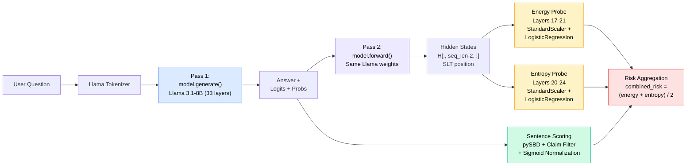

# SemanticEnergy — AI/ML Solution Architectural Diagram

## SLT 2-Pass Inference Pipeline

## Draw.io Build Guide

Since this diagram is complex (like the encoder-decoder example from your slides), **draw.io** will give the best thesis-quality result. Here's the exact layout:

### Layout: Left-to-right flow, 5 colored zones

**Zone 1 — Input (Light Gray)**
- User Question box with example text

**Zone 2 — Pass 1: Generation (Blue #DBEAFE)**
- Token Embedding (4096-dim)
- Transformer block (show 1 layer, label "×33"):
  - Multi-Head Self Attention (32 heads, GQA)
  - RMSNorm
  - Feed Forward (SwiGLU)
  - RMSNorm
- LM Head: Linear (4096 → 128,256)
- Softmax (temperature=0.7)
- Token Sampling
- Output: answer text + logits + probs

**Zone 3 — Sentence Scoring (Green #D1FAE5)** — branches off from Pass 1 output
- pySBD Sentence Splitter
- Claim Filter (regex)
- Sigmoid: conf = 1/(1 + exp(-(μ-33)/3))

**Zone 4 — Pass 2: Hidden State Extraction (Purple #EDE9FE)** — branches off from Pass 1 output
- Same transformer (label "Same Llama weights, new forward pass")
- Hidden State Extraction: H ∈ ℝ^(33 × seq_len × 4096)
- SLT position extraction: H[:, seq_len-2, :]

**Zone 5 — Probe Scoring (Yellow #FEF3C7)**
- Two parallel branches:
  - Energy Probe: Layers 17-21 → Flatten (20,480) → StandardScaler → LogisticRegression → Invert
  - Entropy Probe: Layers 20-24 → Flatten (16,384) → StandardScaler → LogisticRegression
- Merge: combined_risk = mean(energy, entropy)

**Zone 6 — Output (Red #FEE2E2)**
- Risk scores + confidence level
- Per-sentence analysis table

### Color legend at bottom:
| Color | Meaning |
|-------|---------|
| Blue | Pass 1 — Autoregressive Generation |
| Purple | Pass 2 — Hidden State Extraction |
| Green | Sentence Scoring (no model call) |
| Yellow | Linear Probe Prediction |
| Red | Final Output |
