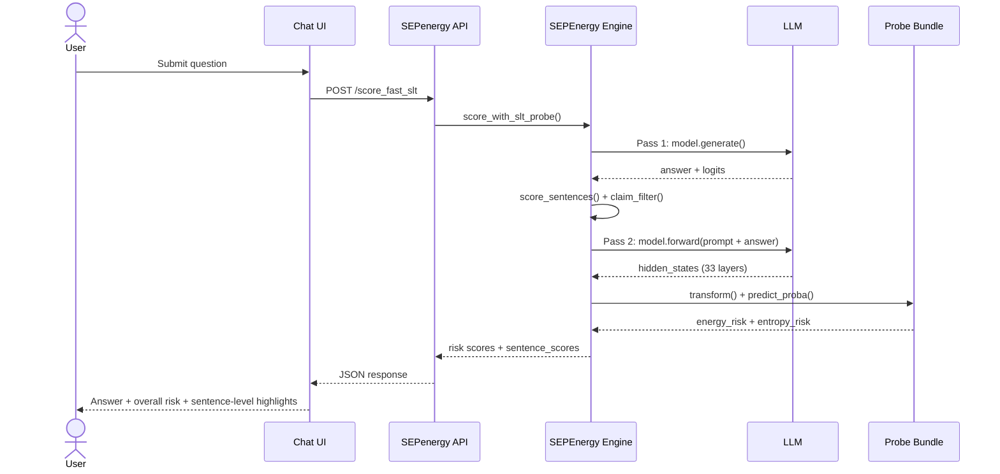
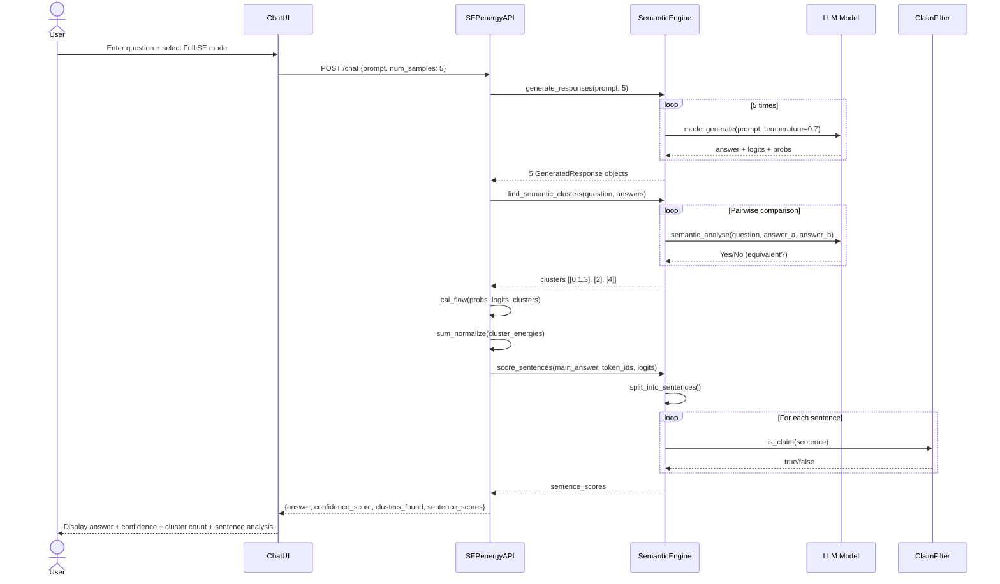
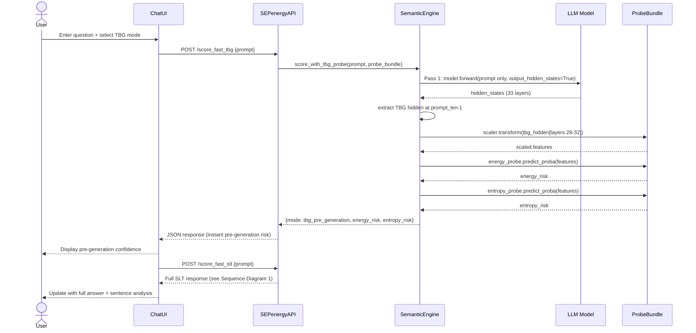

# SemanticEnergy — Sequence Diagrams (OOADM)

## 1. Fast SLT Scoring (Primary Flow — 2 Forward Passes)

```mermaid
sequenceDiagram
    actor User
    participant UI as Chat UI
    participant API as SEPenergy API
    participant Engine as SEPEnergy Engine
    participant LLM as LLM
    participant PB as Probe Bundle

    User->>UI: Submit question
    UI->>API: POST /score_fast_slt
    API->>Engine: score_with_slt_probe()

    Engine->>LLM: Pass 1: model.generate()
    LLM-->>Engine: answer + logits

    Engine->>Engine: score_sentences() + claim_filter()

    Engine->>LLM: Pass 2: model.forward(prompt + answer)
    LLM-->>Engine: hidden_states (33 layers)

    Engine->>PB: transform() + predict_proba()
    PB-->>Engine: energy_risk + entropy_risk

    Engine-->>API: risk scores + sentence_scores
    API-->>UI: JSON response
    UI-->>User: Answer + overall risk + sentence-level highlights
```

## 2. Full Semantic Energy Scoring

```mermaid
sequenceDiagram
    actor User
    participant UI as ChatUI
    participant API as SEPenergyAPI
    participant Engine as SemanticEngine
    participant LLM as LLM Model
    participant CF as ClaimFilter

    User->>UI: Enter question + select Full SE mode
    UI->>API: POST /chat {prompt, num_samples: 5}
    API->>Engine: generate_responses(prompt, 5)

    loop 5 times
        Engine->>LLM: model.generate(prompt, temperature=0.7)
        LLM-->>Engine: answer + logits + probs
    end

    Engine-->>API: 5 GeneratedResponse objects

    API->>Engine: find_semantic_clusters(question, answers)

    loop Pairwise comparison
        Engine->>LLM: semantic_analyse(question, answer_a, answer_b)
        LLM-->>Engine: Yes/No (equivalent?)
    end

    Engine-->>API: clusters [[0,1,3], [2], [4]]

    API->>API: cal_flow(probs, logits, clusters)
    API->>API: sum_normalize(cluster_energies)

    API->>Engine: score_sentences(main_answer, token_ids, logits)
    Engine->>Engine: split_into_sentences()

    loop For each sentence
        Engine->>CF: is_claim(sentence)
        CF-->>Engine: true/false
    end

    Engine-->>API: sentence_scores

    API-->>UI: {answer, confidence_score, clusters_found, sentence_scores}
    UI-->>User: Display answer + confidence + cluster count + sentence analysis
```

## 3. Fast TBG Pre-Generation Scoring

```mermaid
sequenceDiagram
    actor User
    participant UI as ChatUI
    participant API as SEPenergyAPI
    participant Engine as SemanticEngine
    participant LLM as LLM Model
    participant PB as ProbeBundle

    User->>UI: Enter question + select TBG mode
    UI->>API: POST /score_fast_tbg {prompt}
    API->>Engine: score_with_tbg_probe(prompt, probe_bundle)

    Engine->>LLM: Pass 1: model.forward(prompt only, output_hidden_states=True)
    LLM-->>Engine: hidden_states (33 layers)

    Engine->>Engine: extract TBG hidden at prompt_len-1

    Engine->>PB: scaler.transform(tbg_hidden[layers 28-32])
    PB-->>Engine: scaled features
    Engine->>PB: energy_probe.predict_proba(features)
    PB-->>Engine: energy_risk
    Engine->>PB: entropy_probe.predict_proba(features)
    PB-->>Engine: entropy_risk

    Engine-->>API: {mode: tbg_pre_generation, energy_risk, entropy_risk}
    API-->>UI: JSON response (instant pre-generation risk)
    UI-->>User: Display pre-generation confidence

    UI->>API: POST /score_fast_slt {prompt}
    API-->>UI: Full SLT response (see Sequence Diagram 1)
    UI-->>User: Update with full answer + sentence analysis
```
