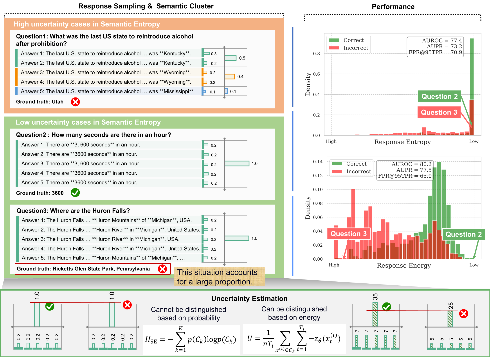

# SemanticEnergy

A real-time LLM hallucination detection system built on the **Semantic Energy** framework — an approach that goes beyond traditional entropy-based methods by using **logit-space energy functions** to quantify uncertainty.

> **Paper**: [Semantic Energy: Detecting LLM Hallucination Beyond Entropy](https://arxiv.org/abs/2508.14496)



This implementation extends the original paper with **linear probes trained on hidden states**, enabling fast single-pass hallucination scoring without multi-sample generation or clustering.

---

## What's in This Repo

| Component | Description |
|---|---|
| **Full Semantic Energy** | Original paper method — 5 diverse generations + LLM semantic clustering + Fermi-Dirac energy flow |
| **Fast TBG Probe** | Pre-generation risk score in ~0.5–2s — reads the model's hidden state at the last prompt token |
| **Fast SLT Probe** | Post-generation risk score in ~5–15s — reads the hidden state at the second-to-last generated token |
| **B1 Sentence Baseline** | Per-sentence logit confidence scoring — highlights the lowest-confidence sentence in any response |

---

## Hardware Requirements

| Requirement | Details |
|---|---|
| **Python** | 3.12 (recommended) |
| **GPU** | NVIDIA GPU with CUDA 12.4 — **required**, CPU not supported |
| **VRAM** | 10–12 GB (Llama 3.1 8B in 8-bit quantization) |
| **Disk Space** | ~10 GB (model weights downloaded on first run) |
| **RAM** | 16 GB minimum |

> Tested on NVIDIA RTX 3060 12 GB. The model loads at ~9 GB VRAM with `bitsandbytes` 8-bit quantization.

---

## Project Structure

```
SemanticEnergy/
├── backend/
│   ├── app.py                  # FastAPI server — /chat, /score_fast_tbg, /score_fast_slt
│   ├── engine.py               # SemanticEngine: generation, clustering, probes, energy
│   ├── claim_filter.py         # Claim sentence filtering
│   ├── data/                   # Generated datasets & checkpoints (gitignored)
│   └── models/
│       ├── probes_llama3-8b_triviaqa.pkl   # Trained probes for Llama 3.1 8B
│       └── probes_qwen3-8b_triviaqa.pkl    # Trained probes for Qwen3 8B
├── frontend/
│   ├── index.html              # Chat UI with 3-mode selector + metrics guide
│   ├── script.js               # Frontend logic + score history chart
│   ├── styles.css              # Styling
│   └── vercel.json             # Vercel deployment config
├── notebooks/
│   ├── 00_preflight.ipynb      # Formula verification — energy & entropy teacher signals
│   ├── 01_generate_dataset.ipynb   # Collect 500 TriviaQA records with hidden states
│   ├── 02_train_se_probes.ipynb    # Train & evaluate 4 probes, save bundle
│   └── 04_sentence_baseline.ipynb  # B1 per-sentence logit confidence baseline
├── SemanticEnergy_Colab.ipynb  # Colab deployment notebook (backend on free T4 GPU)
├── start.ps1                   # One-command local launcher (Windows/PowerShell)
├── requirements.txt            # Python dependencies
└── README.md
```

---

## Quick Setup (Local)

```bash
git clone https://github.com/DangerDudeSL/SemanticEnergyV1.git
cd SemanticEnergyV1

python -m venv .venv
.venv\Scripts\activate           # Windows
# source .venv/bin/activate      # Linux/macOS

pip install torch --index-url https://download.pytorch.org/whl/cu124
pip install -r requirements.txt
```

---

## Running Locally

**Windows (PowerShell) — one command:**
```powershell
.\start.ps1
```

**Manual start:**
```bash
# Terminal 1 — Backend (loads Llama 3.1 8B, takes ~60s on first run)
cd backend && python app.py
# API at http://127.0.0.1:8000

# Terminal 2 — Frontend
cd frontend && python -m http.server 3000
# Open http://127.0.0.1:3000
```

> **First run:** Llama 3.1 8B Instruct (~16 GB fp16, ~9 GB in 8-bit) is downloaded automatically from Hugging Face. You need a Hugging Face account and must accept the model's license at [meta-llama/Llama-3.1-8B-Instruct](https://huggingface.co/meta-llama/Llama-3.1-8B-Instruct).

---

## Scoring Modes

Select the mode in the UI before sending a message:

### Full SE (Full Semantic Energy)
`POST /chat`

The original paper method. Generates 5 diverse responses, clusters them semantically using the LLM itself as a verifier, then computes Fermi-Dirac logit energy flows across clusters.

- **Time:** ~60–120s
- **Signal:** Multi-sample semantic agreement
- **Output:** Confidence score + number of semantic clusters found

### Fast SLT (Second-to-Last Token probe)
`POST /score_fast_slt`

Generates one response, then runs a single forward pass on `prompt + answer` to extract the hidden state at the second-to-last generated token. A trained logistic regression probe predicts hallucination risk from that hidden state.

- **Time:** ~5–15s
- **Signal:** Post-generation internal representation
- **Output:** Answer + combined risk score

### Fast TBG (Token Before Generation probe)
`POST /score_fast_tbg`

Runs a single forward pass on the **prompt only** — no generation. Extracts the hidden state at the last prompt token and scores it with a trained probe. This gives a hallucination risk estimate *before the model writes a single word*.

- **Time:** ~0.5–2s
- **Signal:** Pre-generation internal representation
- **Output:** Risk score (answer generated afterwards via a follow-up SLT call)

---

## API Reference

All endpoints accept `POST` with JSON body.

### `POST /chat`
```json
{ "prompt": "What is the speed of light?", "num_samples": 5, "model_id": "meta-llama/Llama-3.1-8B-Instruct" }
```
```json
{
  "answer": "The speed of light is approximately 299,792,458 metres per second.",
  "confidence_score": 0.87,
  "confidence_level": "high",
  "clusters_found": 1
}
```

### `POST /score_fast_slt`
```json
{ "prompt": "What is the speed of light?" }
```
```json
{
  "mode": "slt_post_generation",
  "answer": "The speed of light is approximately 299,792,458 metres per second.",
  "energy_risk": 0.12,
  "entropy_risk": 0.18,
  "combined_risk": 0.15,
  "confidence_level": "high"
}
```

### `POST /score_fast_tbg`
```json
{ "prompt": "What is the speed of light?" }
```
```json
{
  "mode": "tbg_pre_generation",
  "energy_risk": 0.10,
  "entropy_risk": 0.16,
  "combined_risk": 0.13,
  "confidence_level": "high"
}
```

---

## Probe Training Pipeline

The fast scoring modes require trained probes. The pre-trained bundle is included at `backend/models/probes_llama3-8b_triviaqa.pkl`. To retrain from scratch:

### Step 1 — Verify formulas
```
notebooks/00_preflight.ipynb
```
Verifies the energy and entropy teacher signal formulas with synthetic data. No GPU needed.

### Step 2 — Collect dataset
```
notebooks/01_generate_dataset.ipynb
```
Runs the full Semantic Energy pipeline on 500 TriviaQA questions. For each question it records:
- 5 generated responses with per-token logits and probabilities
- Semantic cluster assignments
- Energy and entropy teacher scores
- Hidden states at TBG and SLT token positions (all 33 layers)

Saves to `backend/data/probe_dataset_llama3-8b_triviaqa.pkl` (~540 MB).
**Requires GPU. Estimated time: 4–6 hours.**

### Step 3 — Train probes
```
notebooks/02_train_se_probes.ipynb
```
- Binarizes teacher scores using SEP-style within-group MSE minimisation (no correctness labels)
- Sweeps all 33 layers to find the best layer range for each probe
- Trains 4 logistic regression probes (TBG energy, TBG entropy, SLT energy, SLT entropy)
- Runs feature ablation and bootstrap AUROC evaluation
- Saves the probe bundle to `backend/models/probes_llama3-8b_triviaqa.pkl`

**No GPU needed for this notebook.**

### Probe Results (TriviaQA, Llama 3.1 8B Instruct)

| Probe | Best Layers | Val AUROC | Test AUROC |
|---|---|---|---|
| TBG Energy | 28–32 | 0.871 | 0.748 |
| TBG Entropy | 21–25 | 0.869 | 0.786 |
| SLT Energy | 17–21 | 0.741 | 0.667 |
| SLT Entropy | 20–24 | 0.793 | 0.788 |

Teacher upper bounds (test set): Energy 0.710, Entropy 0.714.

---

## How Semantic Energy Works

### Step 1 — Sample responses

Generate N diverse responses for a question using sampling (`do_sample=True`). Collect per-token logits and probabilities for each response.

### Step 2 — Semantic clustering

Use the LLM itself as a semantic verifier — for each pair of responses, ask it whether they are semantically equivalent. Greedy decoding (`do_sample=False`) is used here for deterministic decisions. Group semantically equivalent responses into clusters.

### Step 3 — Compute energy

For each cluster, aggregate the token-level logits using a Boltzmann (or Fermi-Dirac) energy function, then weight by cluster probability mass:

```
energy_cluster_i = -mean(logits for responses in cluster_i)
cluster_prob_i   = sum(response_probs in cluster_i) / sum(all response_probs)
SE_score         = sum_normalize(cluster_energies)[main_cluster_index]
```

Higher SE score = higher confidence = lower hallucination risk.

### Token Positions for Probes

```
Prompt tokens:  [t1, t2, ..., tN]   ← TBG = hidden state at tN (last prompt token)
Answer tokens:  [a1, a2, ..., aM, EOS]  ← SLT = hidden state at aM (second-to-last)
```

Both positions are extracted via a **separate forward pass** on `prompt + answer` using `output_hidden_states=True`, reading all 33 transformer layers. The probe uses a 4-layer window (e.g., layers 21–25) concatenated and flattened as input features.

---

## Cloud Deployment (Vercel + Google Colab)

The recommended deployment architecture for demos and testing. **Total cost: $0.**

```
┌──────────────────┐                          ┌─────────────────────────┐
│  Vercel (FREE)   │        HTTPS/JSON        │  Google Colab (FREE)    │
│                  │ ──────────────────────>   │                         │
│  index.html      │                          │  FastAPI (app.py)       │
│  script.js       │   ngrok static domain    │  engine.py              │
│  styles.css      │ <──────────────────────  │  probes.pkl (from HF)   │
│                  │                          │  Llama 3.1 8B on T4     │
│  Permanent URL   │                          │  12h session (restart)  │
└──────────────────┘                          └─────────────────────────┘
```

### Step 1: Set Up ngrok (one-time)

1. Sign up at [ngrok.com](https://ngrok.com) (free)
2. Copy your auth token from [dashboard.ngrok.com](https://dashboard.ngrok.com/get-started/your-authtoken)
3. Note your free static domain from [dashboard.ngrok.com/domains](https://dashboard.ngrok.com/domains) (e.g. `abc123.ngrok-free.dev`)

### Step 2: Deploy Frontend to Vercel (one-time)

1. Sign up at [vercel.com](https://vercel.com) (use GitHub login)
2. Import the `SemanticEnergy` GitHub repo
3. Set **root directory** to `frontend/`
4. Deploy — gives you a permanent URL like `semantic-energy.vercel.app`
5. In `frontend/script.js`, set `BACKEND_URL` to your ngrok static domain:
   ```javascript
   const BACKEND_URL = 'https://abc123.ngrok-free.dev';
   ```

### Step 3: Start Backend on Colab (each session)

[](https://colab.research.google.com/github/DangerDudeSL/SemanticEnergyV1/blob/master/SemanticEnergy_Colab.ipynb)

1. Open the Colab notebook (click badge above)
2. Set runtime to **T4 GPU** (Runtime -> Change runtime type)
3. Fill in your ngrok token and static domain in the config cell
4. Run all cells — backend starts with all endpoints
5. Open your Vercel URL in a browser

> The frontend is always online. Only the Colab backend needs manual start per session (~60-90s to load the model).

### Why Self-Hosted

Semantic Energy requires **full per-token logits** from the language model. Most API providers expose only top-5 log-probabilities or nothing at all — incompatible with the clustering and probe pipeline.

| Provider | Logits Available? | Compatible? |
|---|---|---|
| **OpenAI** | Top-5 logprobs only | No |
| **Anthropic** | No | No |
| **Google Gemini** | No | No |
| **Together AI** | Full logprobs | Possible with code changes |
| **Self-hosted vLLM** | Full logits | Fully compatible |

---

## Citation

```bibtex
@article{ma2025semantic,
  title={Semantic Energy: Detecting LLM Hallucination Beyond Entropy},
  author={Ma, Huan and Pan, Jiadong and Liu, Jing and Chen, Yan and Joey Tianyi Zhou and Wang, Guangyu and Hu, Qinghua and Wu, Hua and Zhang, Changqing and Wang, Haifeng},
  journal={arXiv preprint arXiv:2508.14496},
  year={2025}
}
```

For questions or issues, please open a GitHub issue.
